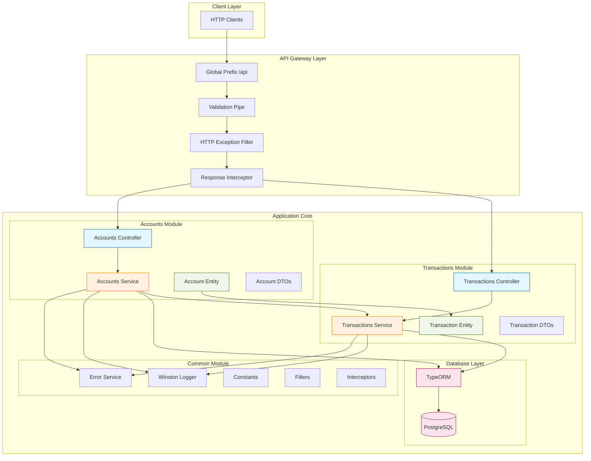
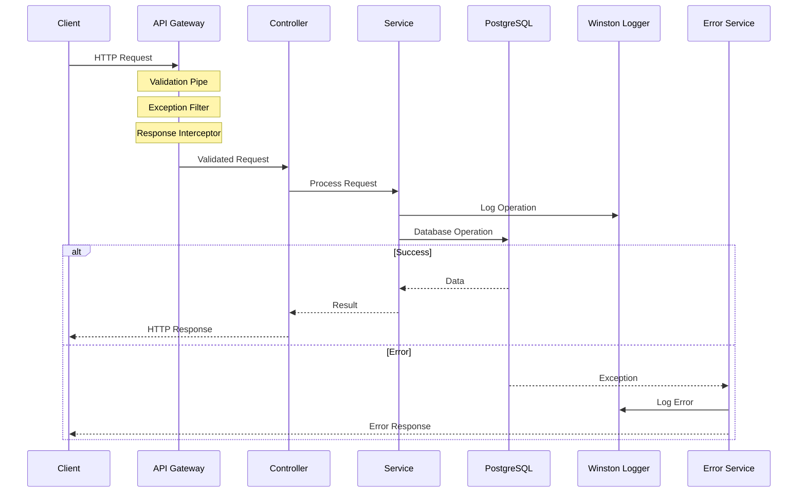
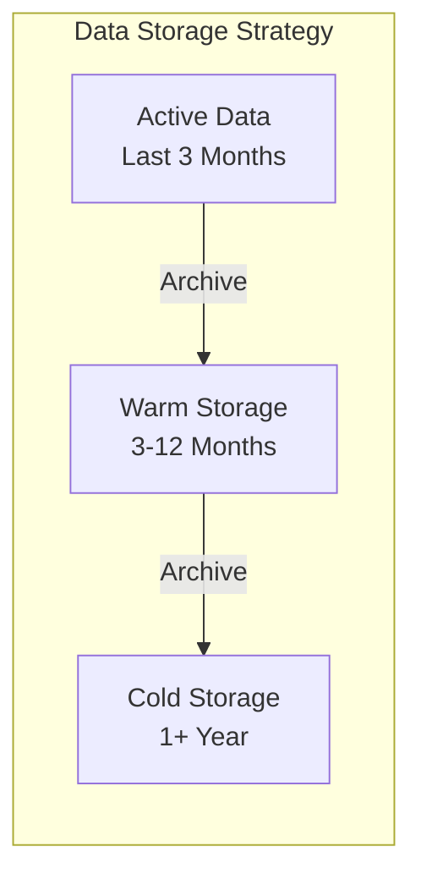
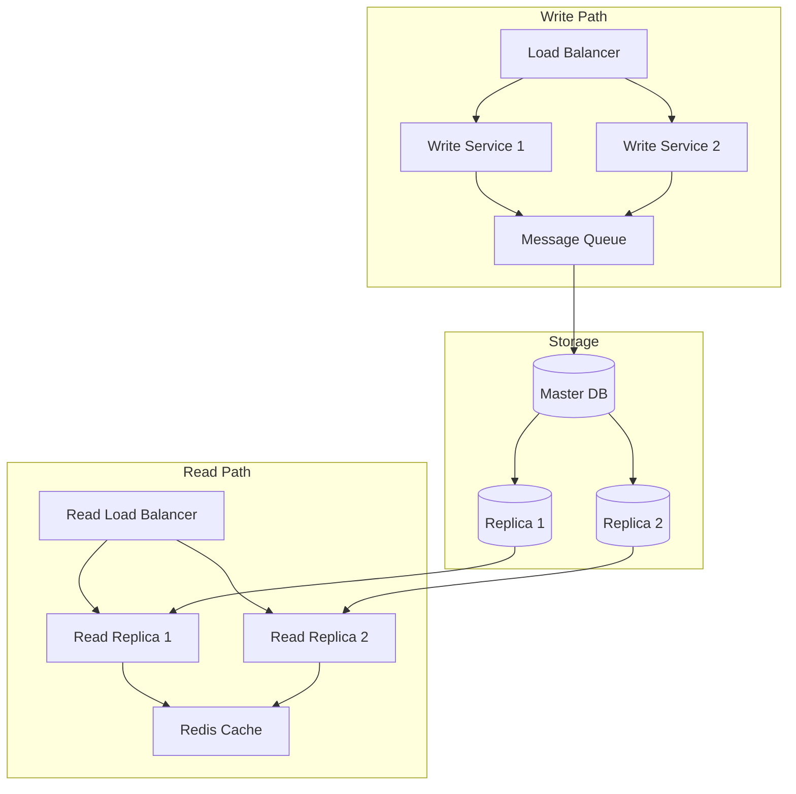

# 🏦 Fintech Application

[](https://nestjs.com)
[](https://www.typescriptlang.org)
[](https://www.postgresql.org)
[](https://www.docker.com)
[](http://localhost:3000/api/docs)

A robust, production-ready fintech application built with NestJS, featuring secure account management and financial transaction processing with full ACID compliance.

## ✨ Features

### Core Functionality
- 🏦 Account Management
  - Create and manage accounts
  - Real-time balance tracking
  - Account history and reporting
- 💰 Transaction Processing
  - Secure deposit operations
  - Withdrawal handling with balance validation
  - Transaction history with pagination

### Technical Features
- 🔒 Database & Data Safety
  - PostgreSQL with ACID compliance
  - REPEATABLE READ isolation level
  - Automatic transaction rollbacks
- 📚 API Documentation
  - Interactive Swagger UI
  - Detailed API specifications
  - Request/Response examples
- 🐳 Deployment
  - Docker & Docker Compose support
  - Multi-stage builds
  - Production-ready configuration

## Architecture

The application follows a modular monolith architecture that can be easily transformed into microservices in the future. It is built with the following components:

- **Accounts Module**: Handles account creation and balance management
- **Transactions Module**: Manages financial transactions with proper isolation levels
- **Common Module**: Contains shared utilities, filters, and interceptors

### Database Design

- **Accounts Table**: Stores account information and balances
- **Transactions Table**: Records all financial transactions with references to accounts

### Transaction Management

The application uses database transactions with REPEATABLE READ isolation level to ensure data consistency during financial operations.

## API Endpoints

### Accounts

- `POST /api/accounts` - Create a new account
- `GET /api/accounts` - Get all accounts
- `GET /api/accounts/:id` - Get account by ID
- `GET /api/accounts/:id/balance` - Get account balance

### Transactions

- `POST /api/transactions` - Create a new transaction
- `POST /api/transactions/deposit` - Deposit funds to an account
- `POST /api/transactions/withdraw` - Withdraw funds from an account
- `GET /api/transactions/account/:accountId` - Get all transactions for an account

## Getting Started

### 📋 Prerequisites

#### Required Software
- Node.js (v18 or later)
- npm (v9 or later)
- Docker (latest version)

#### Recommended VS Code Extensions
- ESLint
- Prettier
- Docker
- REST Client
- Postman

### 🚀 Installation

#### Local Development Setup

1. Clone the repository
```powershell
git clone [https://github.com/yossefezzat/wallet-management.git](https://github.com/yossefezzat/wallet-management.git)
cd fintech-app
```

2. Install dependencies
```powershell
npm install
```

3. Set up environment variables
```powershell
Copy-Item .env.example .env
# Edit .env with your configuration
```

4. Start PostgreSQL with Docker
```powershell
docker-compose up postgres -d
```

5. Initialize the database
```powershell
npm run db:init
```

6. Start the application in development mode
```powershell
npm run start:dev
```

The application will be available at:
- API: [http://localhost:3000](http://localhost:3000)
- Swagger UI: [http://localhost:3000/api/docs](http://localhost:3000/api/docs)

#### Development Tools

- Enable watch mode for automatic rebuilds:
```powershell
npm run start:debug
```

- Run linting:
```powershell
npm run lint
```

- Run formatting:
```powershell
npm run format
```

#### Environment Variables

| Variable | Description | Default |
|----------|-------------|---------|
| `PORT` | Application port | 3000 |
| `DATABASE_HOST` | PostgreSQL host | localhost |
| `DATABASE_PORT` | PostgreSQL port | 5432 |
| `DATABASE_USER` | Database username | postgres |
| `DATABASE_PASSWORD` | Database password | postgres |
| `DATABASE_NAME` | Database name | fintech |
| `NODE_ENV` | Environment | development |

### 🐳 Running with Docker

The application is fully dockerized and can be run with a single command. Here's how to get started:

1. Build and start all services:
```powershell
docker-compose up --build -d
```

2. Check service status:
```powershell
docker-compose ps
```

3. View logs in real-time:
```powershell
docker-compose logs -f api
```

4. Stop all services:
```powershell
docker-compose down
```

To reset everything and start fresh:
```powershell
docker-compose down -v
docker-compose up --build -d
```

### 📚 API Documentation

The API documentation is available through Swagger UI:

1. Start the application (if not already running)
2. Visit [http://localhost:3000/api/docs](http://localhost:3000/api/docs)
3. Features available in Swagger UI:
   - Interactive API testing
   - Request/Response examples
   - Model schemas
   - Authentication setup (when implemented)

You can also export the OpenAPI specification:
```powershell
curl http://localhost:3000/api-json > openapi.json
```

## 🧪 Testing

### Unit Tests
Run unit tests:
```powershell
npm test
```

Watch mode for development:
```powershell
npm run test:watch
```

### E2E Tests
Run end-to-end tests:
```powershell
npm run test:e2e
```

### Test Coverage
Generate coverage report:
```powershell
npm run test:cov
```

View the detailed coverage report at `coverage/lcov-report/index.html`

### Continuous Testing
For development with continuous testing:
```powershell
npm run test:watch -- path/to/specific.spec.ts
```

## 🏗️ Design Decisions

### Modular Monolith

The application is designed as a modular monolith to balance development speed with future scalability. Each module is self-contained with its own controllers, services, and entities, making it easy to extract into microservices later.

### Database Transactions

Financial operations use database transactions with REPEATABLE READ isolation level to prevent race conditions and ensure data consistency.

### Global Response Format

All API responses follow a consistent format with success status, data, and message fields, making it easier for clients to process responses.

### Error Handling

A global exception filter captures and formats all errors consistently, providing clear error messages to clients.

## Challenges

- Ensuring data consistency during concurrent financial transactions
- Designing a flexible architecture that can scale to microservices
- Implementing proper validation for financial operations

## 🚀 Future Improvements

### Planned Features
- 🔐 Authentication & Authorization
  - JWT-based authentication
  - Role-based access control
  - OAuth2 integration
  
- 📊 Enhanced Transaction Management
  - Event sourcing implementation
  - Real-time transaction notifications
  - Transaction categorization
  
- 🔍 Monitoring & Observability
  - Comprehensive logging system
  - Prometheus metrics integration
  - Grafana dashboards
  
- ⚡ Performance & Security
  - API rate limiting
  - Request caching
  - Security headers implementation

### 🏗️ Application Architecture Diagram



### Request Flow



The architecture follows these key principles:

1. **Modular Organization**
   - Clear separation between modules
   - Each module is self-contained
   - Shared functionality in Common module

2. **Request Processing**
   - Global prefix for all API routes
   - Request validation using pipes
   - Consistent error handling
   - Standardized response format

3. **Data Flow**
   - Controllers handle HTTP requests
   - Services contain business logic
   - TypeORM manages database operations
   - Winston handles logging

4. **Error Handling**
   - Centralized error service
   - Global exception filters
   - Structured error responses

## 📊 Scaling Strategy

### High-Volume Transaction Processing



### Database Partitioning Strategy

1. **Time-Based Partitioning**
   ```sql
   -- Example partition scheme
   CREATE TABLE transactions (
       id UUID PRIMARY KEY,
       created_at TIMESTAMP,
       -- other columns
   ) PARTITION BY RANGE (created_at);

   -- Monthly partitions
   CREATE TABLE transactions_2024_01 
   PARTITION OF transactions 
   FOR VALUES FROM ('2024-01-01') TO ('2024-02-01');
   ```

2. **Indexing Strategy**
   ```sql
   -- Partial index for recent transactions
   CREATE INDEX idx_recent_txns ON transactions(account_id, created_at) 
   WHERE created_at >= NOW() - INTERVAL '3 months';

   -- Composite index for reporting
   CREATE INDEX idx_account_type ON transactions(account_id, type, created_at);
   ```

### Scalability Architecture



### Implementation Phases

1. **Phase 1: Foundation (Month 1-2)**
   - Implement table partitioning
   - Set up basic monitoring
   - Configure proper indexes

2. **Phase 2: Optimization (Month 3-4)**
   - Deploy read replicas
   - Implement Redis caching
   - Set up async processing

3. **Phase 3: Advanced Features (Month 5-6)**
   - Implement event sourcing
   - Set up data warehousing
   - Deploy distributed tracing

### Performance Metrics

| Metric | Target |
|--------|--------|
| Transaction Throughput | 10,000 TPS |
| Read Latency | < 100ms |
| Write Latency | < 200ms |
| Data Growth | ~1TB/month |

### Monitoring & Alerts

- **System Health**
  - Transaction throughput
  - Response times
  - Error rates
  - Queue depths

- **Database Metrics**
  - Partition sizes
  - Index usage
  - Query performance
  - Replication lag

- **Infrastructure**
  - CPU/Memory usage
  - Disk I/O
  - Network latency
  - Cache hit rates

### Scaling Considerations

- **Horizontal Scaling**
  - Read replicas for query distribution
  - Sharding by account ID ranges
  - Geographic distribution

- **Vertical Scaling**
  - Optimize query patterns
  - Efficient indexing strategies
  - Resource allocation

- **Caching Strategy**
  - Redis for hot data
  - Materialized views
  - Query result caching

